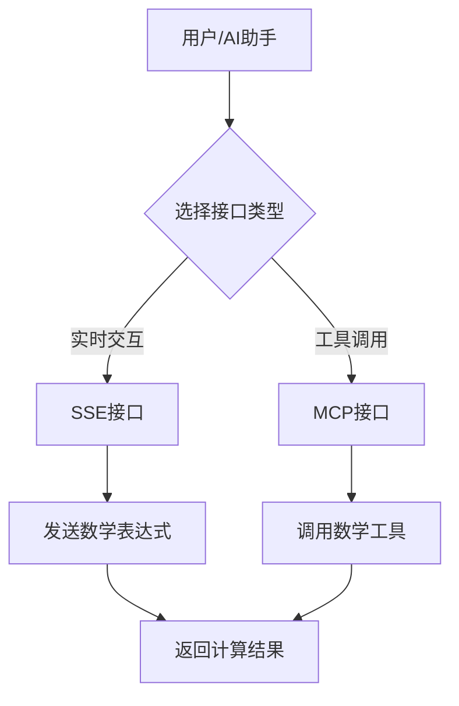

## 1. 产品概述

数学运算工具-Cloudflare版本是一个基于MCP（Model Context Protocol）协议的数学计算服务，运行在Cloudflare Worker平台上。该工具为AI助手和应用程序提供强大的数学运算能力，包括基础运算、高级数学函数、矩阵运算和符号计算等功能。

产品旨在为需要数学计算能力的AI应用提供可靠、高效的云端数学运算服务，通过标准化的MCP协议接口实现无缝集成。

## 2. 核心功能

### 2.1 用户角色

| 角色 | 访问方式 | 核心权限 |
|------|----------|----------|
| 默认用户 | 直接访问API端点 | 可使用所有数学运算功能 |

### 2.2 功能模块

我们的数学运算工具包含以下主要页面：
1. **SSE体验页面**：提供服务器发送事件接口，支持实时数学运算交互
2. **MCP服务页面**：提供标准MCP协议接口，支持AI助手集成

### 2.3 页面详情

| 页面名称 | 模块名称 | 功能描述 |
|----------|----------|----------|
| SSE体验页面 | 实时计算接口 | 提供基于SSE的实时数学表达式计算，支持基础运算、三角函数、矩阵运算等 |
| MCP服务页面 | MCP协议接口 | 提供标准MCP工具调用接口，包含9个数学运算工具：表达式计算、高级运算、矩阵操作、符号计算、求导、有理化等 |

## 3. 核心流程

用户可以通过两种方式使用数学运算服务：
1. **直接访问流程**：用户访问SSE或MCP端点 → 发送数学表达式或调用特定工具 → 获取计算结果
2. **AI集成流程**：AI助手通过MCP协议连接服务 → 调用相应的数学工具 → 返回计算结果给用户



## 4. 用户界面设计

### 4.1 设计风格

- **主色调**：蓝色系（#0066CC）和白色
- **按钮样式**：现代扁平化设计
- **字体**：系统默认字体，代码部分使用等宽字体
- **布局风格**：简洁的API文档风格
- **图标风格**：简约线性图标

### 4.2 页面设计概览

| 页面名称 | 模块名称 | UI元素 |
|----------|----------|--------|
| SSE体验页面 | 实时计算界面 | 输入框、实时结果显示区域、连接状态指示器 |
| MCP服务页面 | 工具调用界面 | JSON格式的请求/响应示例、工具列表、参数说明 |

### 4.3 响应式设计

产品采用桌面优先的设计理念，同时支持移动端自适应，确保在各种设备上都能正常使用数学运算功能。

## 5. 技术架构

### 5.1 技术栈

- **运行环境**：Cloudflare Workers
- **开发语言**：TypeScript
- **核心框架**：
  - Hono（Web框架）
  - @modelcontextprotocol/sdk（MCP协议支持）
  - mathjs（数学运算库）
  - agents（MCP代理库）
- **构建工具**：Wrangler
- **代码质量**：Biome（格式化和代码检查）

### 5.2 核心模块

1. **入口模块（index.ts）**：配置路由，挂载SSE和MCP服务
2. **MCP服务模块（mcp.ts）**：实现MCP协议，定义数学工具
3. **工具模块（tools.ts）**：封装mathjs库，提供具体的数学运算功能
4. **标准输入输出模块（stdio.ts）**：处理标准输入输出

### 5.3 可用工具列表

1. **evaluateMath**：解析并计算数学表达式
2. **calculateSimple**：计算简单数学表达式
3. **calculateAdvanced**：支持四则运算的高级计算器
4. **createMatrix**：创建矩阵
5. **matrixAdd**：矩阵加法运算
6. **matrixMultiply**：矩阵乘法运算
7. **symbolicCompute**：符号计算
8. **derivative**：求导数
9. **rationalize**：表达式有理化

## 6. 部署说明

### 6.1 部署要求

- Cloudflare账户
- Wrangler CLI工具
- Node.js环境

### 6.2 部署步骤

1. 克隆项目代码
2. 安装依赖：`pnpm install`
3. 修改wrangler.jsonc中的域名配置
4. 执行部署：`pnpm run deploy`

### 6.3 环境配置

- **兼容性日期**：2025-03-10
- **Node.js兼容性**：已启用
- **自定义域名**：math.sereniblue.com

## 7. API接口文档

### 7.1 访问端点

- **SSE接口**：`https://math.sereniblue.com/sse`
- **MCP接口**：`https://math.sereniblue.com/mcp`

### 7.2 工具调用示例

```json
{
  "tool": "evaluateMath",
  "arguments": {
    "expression": "sin(pi/2) + cos(0)"
  }
}
```

### 7.3 响应格式

所有工具调用都返回统一的响应格式：
```json
{
  "content": [
    {
      "type": "text",
      "text": "计算结果"
    }
  ]
}
```

## 8. 使用示例

### 8.1 基础数学运算

```javascript
// 计算表达式
evaluateMath("2*(3+4)")
// 结果：14

// 三角函数
evaluateMath("sin(pi/2)")
// 结果：1
```

### 8.2 矩阵运算

```javascript
// 创建矩阵
createMatrix([[1,2],[3,4]])

// 矩阵加法
matrixAdd([[1,2],[3,4]], [[5,6],[7,8]])
// 结果：[[6,8],[10,12]]
```

### 8.3 符号计算

```javascript
// 求导
derivative("x^2 + 3x", "x")
// 结果：2*x + 3

// 有理化
rationalize("1/(x+1) + 1/(x-1)")
// 结果：(2*x)/(x^2-1)
```

## 9. 维护和扩展

### 9.1 代码质量

项目使用Biome进行代码格式化和质量检查：
- `pnpm run format`：格式化代码
- `pnpm run lint:fix`：修复代码问题

### 9.2 类型检查

使用TypeScript进行严格的类型检查：
- `pnpm run type-check`：执行类型检查

### 9.3 扩展指南

要添加新的数学工具：
1. 在tools.ts中实现具体的数学函数
2. 在mcp.ts中注册新的MCP工具
3. 更新文档和测试用例

项目采用模块化设计，便于功能扩展和维护。